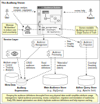

# Audlang Specification

The **Audience Definition Language** is part of project [Audlang](https://github.com/users/KarlEilebrecht/projects/1/views/1?pane=info) to define a standard expression language for defining audiences for advertising purposes.

:point_right: Here you can find the **[motivation for this project](./doc/Motivation.md).**



The project **audlang-spec** is primarily a **specification project** to maintain the [Audience Definition Language Specification](./doc/AudienceDefinitionLanguageSpecification.md). Its main artifact is a zip-archive including the [ANTLR4-grammar](./src/main/antlr4/Audlang.g4), the language documentation and a comprehensive number of samples for testing your parser implementation. Latest artifacts are available on [Maven Central](https://central.sonatype.com/namespace/de.calamanari.adl).

Because it was necessary to test the specification *before* creating a full-fledged parser implementation, I have created supplementary Java-code that runs during the build of this project but is not part of the zip-archive. Instead the build process additionally produces a JAR-artifact. 

**Clarification:** In the specification project, we don't make any assumptions about the programming language used to implement the Audlang. Java was simply my choice to implement the specification tests.

However, this simplifies the implementation of parsers implemented in Java. Simply create a dependency to this JAR to inherit the generated ANTLR base-classes. The JAR also includes some supplementary code.

```xml
		<dependency>
			<groupId>de.calamanari.adl</groupId>
			<artifactId>audlang-spec</artifactId>
			<version>1.1.0</version>
		</dependency>
```

For further dependencies required to run the java code please refer to this project's POM.

:bulb: The generated samples are not part of the jar, but they can be generated on demand by using the classes from the aforementioned JAR. Review the test classes in this project for details.

----


[](https://sonarcloud.io/summary/new_code?id=KarlEilebrecht_audlang-spec)

