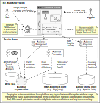

#### [Project Overview](../README.md)
----

# Motivation

Over the last 20 years I have seen a couple of audience builder tools. Although the applications and the underlying data stores varied, the basic problem they address is fairly simple:

 * There is a pool of records in the system, each stores any form of ID together with attributes that describe an individual, either real or synthetic. Let's call this the *base audience* that is hopefully representative for the *population* of a market.
 * There is meta data about the various attributes. E.g., in case of panel data the *attributes* are the answers a particular individual has given.
   * Common meta data: *attribute origin*, *meaning*, *label*, *usage permissions*, etc.
 * An *audience builder* allows creating conditions based on the available attributes used to filter the base audience to define a specific audience (e.g., *"Cat Lovers"*).
 * Basic use cases are:
   * *Counting:* Determining or estimating the size of an audience according to an audience definition.
   * *Materialization:* Filtering the base audience to procude a subset of records according to the audience definition.
   * Most tools additionally provide any kind of profiling, overlap analysis or cross-tabbing *based on the features above*.

*That's all, so what's the deal?*

The crucial part of the above task is a consistent *expression logic*, so you can define, combine and eventually *execute* an audience definition. Executing means counting or selecting records from the base audience that match your audience definition.

Every tool comes with its own grammar and its own backend for processing the expressions.

While the expression languages show a certain feature variety, the core feature set is rather simple. However, all of the tools I have seen so far share a couple of problems:

 * The **language is home-grown**, even if it tries to align to any standard it is rather technically motivated than user-facing (developed by engineers for engineers).
 * There is **no language specification**. If you are lucky there is a bunch of examples. To understand limitations, edge-cases and quirks it is often required to review the application code.
 * **Inconsistencies**: Features have been added over time, by developers with different approaches, skill sets and preferences. E.g., one feature uses round braces, a later added feature uses brackets - for the same purpose.
 * **Incompleteness**: E.g., less than (<) and greater than (>) were added in a particular context but they are still not allowed in a similar scenario. Worst case nobody knows what would happen.
 * **Missing or limited nesting**: E.g., for some reason you can combine an AND with and OR but not vice-versa.
 * **Missing or unclear negation**: E.g., there is a logical NOT, but it is not implemented on a composite expression that combines two conditions with AND.
 * **Unplausible restrictions**: E.g., Some characters look correct in the first place but cause unexpected issues somewhere down the processing chain.
 * **Lack of escaping**: Some attribute values are just not allowed, worst case undocumented.
 * There is **no expression optimization/normalization** which makes it hard to compare expressions and can impede result caching.
 * **Intransparancy**: Usually, expressions are created in a UI, and much later some converter *knows* how to translate this is into some target data store expression (e.g., SQL) to be executed. In between the expression is *opaque*, and there is no way to tell easily which attributes are involved. This is quite uncomfortable for reporting attribute usage statistics or the impact of an attribute removal resp. permission change.
 * **Tight coupling**: The language is tightly coupled to a particular data store or data model. E.g., table-names for certain groups of attributes are integral part of the grammar.
 * **Legacy left-overs**: After a few technology iterations the language gets polluted with legacy fragments. Sometimes they are still present but inactive, worst-case these former features now cause errors.

 The problems above can lead to further issues:
 * Storage technology evolves, databases come and go. Every time you change your database you need to either migrate the expressions or mimic inherited storage structures in your new database which may not be optimal.
 * The two basic use cases *"Counting"* vs. *"Materialization"* may have very different quality requirements. Materialization necessarily must mangle the whole data set (base audience). Often delays are acceptable because the related operations anyway run as (nightly) batches and not just-in-time. Counting (estimation) on the other hand cannot be quick enough. Users expect results almost instantaneously. Sometimes, it is not economic to run both operations on the same data store. Especially, estimation can be executed on a fraction of the data (e.g., 10%) without significant loss of precision. To get the desired performance, it can be a good idea to use a different data store for fast counting queries. This is the point where any expression language that makes assumptions about the data store or the data model becomes a problem.
 * Maintenance and optimization related to the data model or storage layer should happen *independent from any grammar*. If parts of the grammar are intertwined with the table landscape, refactoring becomes a nightmare. Combined with quirky legacy artefacts being part of the grammar and a lack of specification, it is almost impossible to improve the data model without taking serious risks.

Based on the observations above and the review of a couple of existing grammars I decided to first create a specification of the core language features using [ANTLR](https://antlr.org) along with a detailed definition of the features' detail behavior.

 * The specification can be tested using a large test of samples to avoid costly glitches on language level.
 * Parsing can be decoupled and implemented in any higher programming language of choice.
 * Conversion (to run on any target data store) can be decoupled from the language and tested separately.
   * *"Counting"* and *"Materialization"* based on *the same expression* can be treated as separate concerns.

## Expression Language vs. UI-components

Most systems don't show textual expressions to the user at all. Instead there is some graphical expression builder to make it easer to create complex conditions.

However, under the bonnet the created combination of condition needs to be stored somehow. 

You can use JSON for this purpose - but the result looks quite verbose and is hard to read compared to a compact DSL like Audlang that focusses on language features required to define audiences.

## Do I need expressions if I have AI?

This is a valid point! If a user can tell the system in natural language what she wants, and all the magic anyway happens under the bonnet, why should we bother with expressions and conversion?

Well, there are some good reasons, not to hide the whole process in a single *AI-backbox*:
 * **Uncertainty:** There are many steps between a sentence in natural language and the final selection (execution) on a target data store. A lot can go wrong. Everytime, anything does not work as expected, some support guy needs to take a look. Because the processing all the way down to the final target language expression is part of the blackbox, only the final query generated for the target data store can be analyzed. This can be quite hard.
 * **Comparison/Caching:** Two logically identical requests may turn into slightly different queries generated by the AI. This impedes caching.
 * **Attribute usage control:** From existing expressions (target data store language) it is hard to extract which attributes were involved.
 * **Data Layer Maintenance:** Because you store expressions in target system language (e.g., SQL), you have individual expressions for each store you support, and translation/comparison is not easy. Whenever you optimize your data layer, you may again need AI to re-create the existing expressions with some uncertainty about the outcome.
 * **Cost:** You must train your AI for each target system with all its specialties and quirks. Also at execution time this process is rather expensive: for every single request the AI has to go down the full chain from natural language to the execution on the data store.

### Conclusion

*Combine both approaches!*
 

Create a solid language specification for expressions and train the AI to create expressions using this DSL. 
 
Due to the expression language *in the middle* you get:
  * Review availability at any time.
  * Easy attribute usage control.
  * Independent implementation and maintenance of target data store converters.
  * Less AI-training effort and faster AI-generation because the DSL is much simpler than any general-purpose query language (e.g., SQL).

